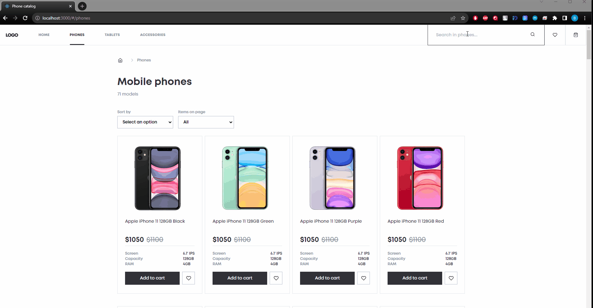
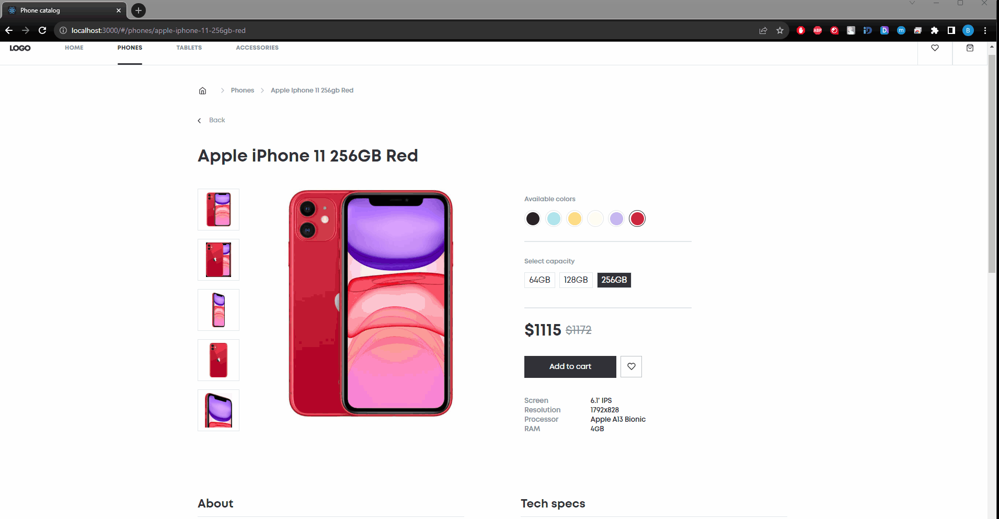
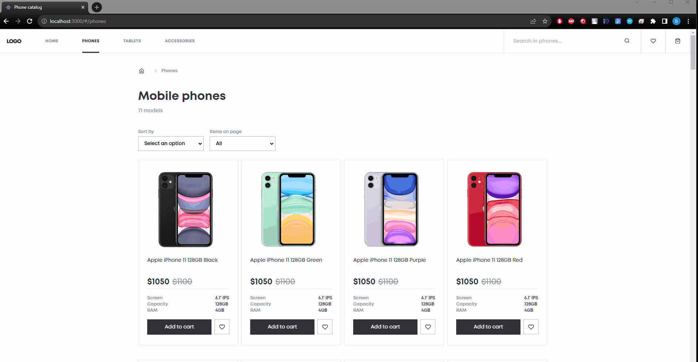
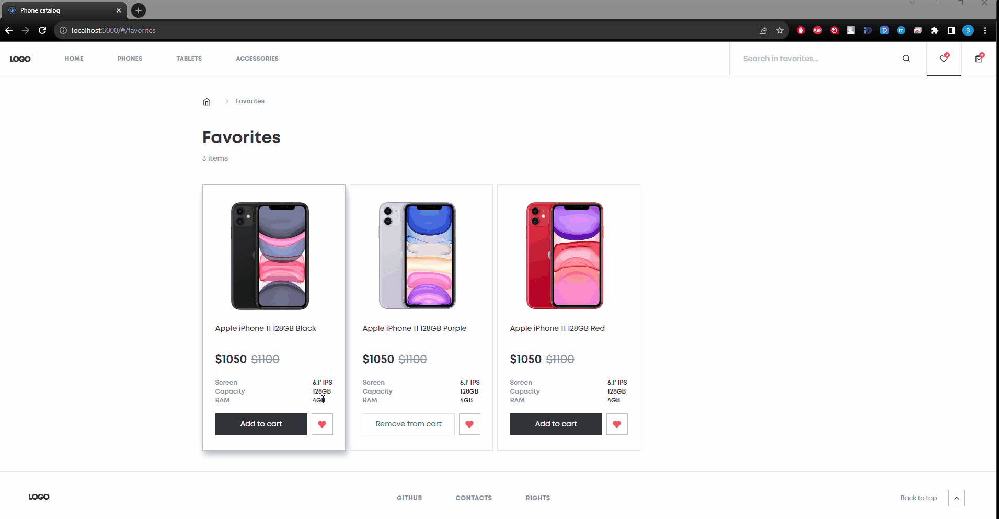

# Online gadgets store
A single-page application implements online store functionality. User can browse products, add them to the cart and favorites, search products, sort products, change the quantity of products in the cart, and view product details.

# [DEMO](https://vpdrabynko.github.io/phone-catalog/)

# Table of contents
- [Technologies used](#technologies-used)
- [Structure](#structure)
- [Features & Functionality](#features--functionality)
- [Reflections](#reflections)

# Technologies used
- React.js
- React Router(v6)
- TypeScript
- JavaScript
- Fetch, API
- Sass (SCSS)
- CSS Modules
- BEM methodology

# Structure
App is built using functional components and React Hooks.
Each component is abstract and fully reusable. Components are styled using Sass (SCSS) and CSS Modules.
BEM methodology is used for naming and styling.

# Features & Functionality

## App 
- App is responsive and works on all screen sizes.
- Navigation is implemented using React Router.

## Home page
- Products sliders with the ability to scroll products by clicking on the arrows. Products are fetched from the server.

## Catalog pages
- Products are fetched from the server by category.
- Ability to sort products by name, price, and age is implemented.

- Pagination is implemented. The number of products displayed on the page can be changed by the user.
- Search and filter products by name is implemented.

## Product details page
- Product details are fetched from the server.
- User can pick a color and capacity of the product.
- Photos of the product can be changed by clicking on the thumbnails.
- User can add the product to the cart or favorites.

## Cart page
- User can change the quantity of products in the cart and remove products from the cart.
- Cart items count is shown near the Cart icon in the header.
- Total amount and quantity are calculated automatically.
- Cart items are saved in the local storage.

## Favorites page
- User can add products to favorites and remove them from favorites.
- Favorites count is shown near the Favorites icon in the header.
- Favorites are saved in the local storage.

## Reflections
Building this online gadgets store application was a valuable learning experience. It involved working with a range of modern web development technologies and best practices. Here are some key takeaways:

- React.js and React Router (v6): Utilizing React and React Router allowed for a structured and efficient development process. The use of React Hooks in functional components contributed to the application's modularity.
- TypeScript: TypeScript proved to be a robust choice for this project, as it enhanced code quality and helped catch errors during development.
- Styling with Sass and CSS Modules: Styling components with Sass and CSS Modules facilitated the maintenance and modularity of the codebase. The BEM methodology further ensured a clean and organized CSS structure.
- API Integration: Fetching data from a remote server using JavaScript's Fetch and working with API endpoints is a fundamental skill in modern web development. It was essential to enable features like product fetching and user interaction.
- Local Storage: Implementing local storage for the cart and favorites allowed for a persistent shopping experience, even after refreshing the page.
- Responsive Design: Ensuring that the application is fully responsive and works seamlessly on different screen sizes is vital for a great user experience.
- User-Focused Features: The ability to sort products, search, filter, and easily interact with the cart and favorites were key features to enhance user engagement and satisfaction.

Overall, this project not only honed technical skills but also emphasized the importance of user-centered design and efficient, maintainable code. The experience gained in this project is invaluable for future web development endeavors.